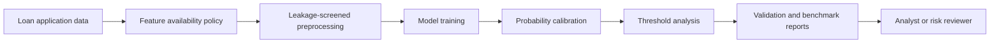
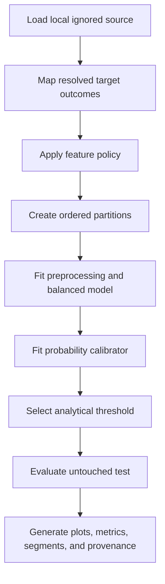
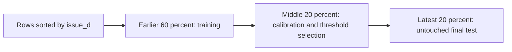
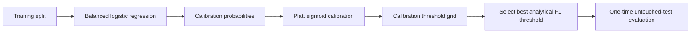
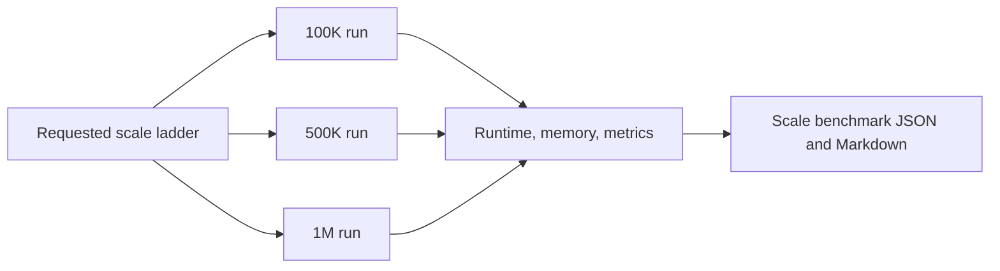
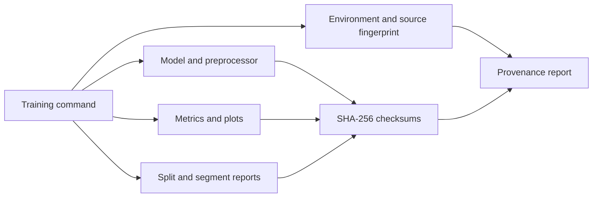

# Credit Risk Predictor: Temporal Validation and Scale Evidence System

[](https://www.python.org/)
[](https://scikit-learn.org/)
[](https://pandas.pydata.org/)
[](https://numpy.org/)
[](https://matplotlib.org/)
[](https://pytest.org/)
[](https://github.com/IjazKakkodDS/credit-risk-predictor/actions/workflows/ci.yml)
[](LICENSE.txt)

A senior-review credit default modelling system focused on temporal validation,
leakage control, calibrated probability estimation, threshold analysis, class
imbalance handling, segment stability, provenance, and measured scale
benchmarking. The repository turns a credit modelling baseline into an
evidence-backed validation workflow while keeping decision authority with
analysts and risk owners.

## Repository Evidence Map

| Evidence | What it documents |
| --- | --- |
| [Model card](docs/evidence/model_card.md) | Purpose, validation design, metrics, limitations, and non-goals |
| [Feature availability policy](docs/evidence/feature_availability_policy.md) | Prediction timing, allowed inputs, and leakage exclusions |
| [Class imbalance policy](docs/evidence/class_imbalance_policy.md) | Balanced weighting and evaluation priorities |
| [Threshold policy](docs/evidence/threshold_policy.md) | Calibration-only threshold selection and operating-policy caveats |
| [Resource profile](docs/evidence/resource_profile.md) | Training, memory, and batch measurements |
| [Data scale context](docs/evidence/data_scale_context.md) | Source scale versus completed execution evidence |
| [Validation report index](reports/model_validation/README.md) | Index of generated model validation artifacts |
| [Scale benchmark report](reports/scale_benchmark_report.md) | Completed 100K, 500K, and 1M training ladder |
| [Batch benchmark report](reports/batch_benchmark_report.md) | Completed synthetic batch inference ladder |
| [Uncalibrated metrics](reports/model_validation/metrics.json) | Untouched-test metrics before probability calibration |
| [Calibrated metrics](reports/model_validation/calibrated_metrics.json) | Calibration results and selected-threshold test metrics |
| [Segment stability report](reports/model_validation/segment_stability.md) | Diagnostic results across available operational segments |

## System Summary

Credit risk estimates can influence approval review, pricing discussions, loss
planning, and portfolio monitoring. A single random-split score is not enough
to support those workflows. It can hide temporal instability, target leakage,
miscalibrated probabilities, and thresholds selected with knowledge of final
test outcomes.

This repository emphasizes:

- application-time feature availability and explicit leakage controls
- ordered temporal training, calibration, and untouched-test partitions
- balanced logistic regression with calibrated probability estimates
- threshold selection on calibration data only
- diagnostic segment stability analysis
- reproducible provenance, checksums, plots, and machine-readable reports
- measured training and batch inference evidence at completed scale levels

The system is not a deployed lending decision engine and does not approve or
reject loans.

## Quantitative Snapshot

| Item | CR-3 evidence |
| --- | --- |
| Source dataset context | Approximately 2,260,701 rows, 151 columns, and 1.675 GB in a local ignored file |
| Completed training scales | 100K, 500K, and 1M requested source-row prefixes |
| Largest completed training scale | 1M requested rows, 571,494 usable resolved outcomes |
| Canonical validation run | 100K requested rows, 87,892 usable outcomes |
| Canonical temporal partitions | 52,735 train, 17,578 calibration, 17,579 untouched test |
| Model | Logistic regression with balanced class weights |
| Input feature contract | 27 leakage-screened inputs, 103 transformed features |
| Calibration | Platt sigmoid calibration |
| Calibration-split Brier | 0.2096 before, 0.1470 after calibration |
| Untouched-test calibrated Brier | 0.1470 |
| Analytical threshold | 0.20, selected on calibration data only |
| Largest completed batch benchmark | 500K rows across five measured runs |
| Verification | 38 tests passed and compile checks clean |
| CI | Python 3.11 compatibility runner with dependency, pytest, and compile checks |
| Full-source execution | Not run and not claimed |

## Business Problem

Credit default modelling must balance two costly error types:

- A false approval can expose a lender or portfolio to avoidable credit loss.
- A false rejection can deny a viable applicant and reduce legitimate lending
  opportunity.

Those costs are asymmetric and vary by product, policy, review capacity, and
economic conditions. Probability quality, validation timing, and threshold
governance therefore matter alongside ranking metrics such as ROC-AUC.

## System Objective

The CR-3 workflow is designed to:

1. Train a model on application-time, leakage-screened features.
2. Validate with temporal ordering when a usable date field exists.
3. Calibrate predicted probabilities on a separate calibration partition.
4. Select analytical thresholds without consulting final test outcomes.
5. Evaluate the selected threshold once on an untouched test partition.
6. Measure training scale, process memory, and batch inference throughput.
7. Persist assumptions, metrics, provenance, checksums, plots, and limitations.

## System Value

| Capability | What changes operationally |
| --- | --- |
| Temporal validation | Exposes time-related degradation that a shuffled split can conceal |
| Probability calibration | Makes probability estimates more interpretable for downstream analysis |
| Threshold analysis | Separates ranking quality from the consequences of a classification cutoff |
| Class imbalance policy | Prevents majority-class accuracy from dominating model assessment |
| Segment stability | Surfaces variation across available operational groups for further review |
| Provenance and checksums | Connects evidence to code, dependencies, source fingerprint, and artifacts |
| Scale benchmarks | Replaces source-size implication with measured runtime and memory evidence |
| CI | Protects repository contracts without requiring private raw data |

## Role in Workflow

The system sits between loan application data and a human risk review process.
It produces calibrated probability estimates, analytical threshold evidence,
validation plots, segment diagnostics, benchmark reports, and governance
artifacts. These outputs support investigation and policy design. They do not
independently approve, reject, or price a loan.

## System Context



## Architecture

### Validation Lifecycle



### Temporal Split Design



The canonical 100K prefix spans October through December 2015. Both calibration
and test rows fall within December 2015, so this is ordered validation rather
than strong multi-vintage evidence.

### Calibration and Threshold Flow



### Scale Benchmark Flow



### Artifact and Provenance Flow



## Model Validation Summary

The canonical CR-3 run loaded a deterministic 100,000-row prefix and retained
87,892 rows with resolved eligible outcomes. The split contained 52,735
training rows, 17,578 calibration rows, and 17,579 untouched test rows.

| Untouched-test measure | Value |
| --- | ---: |
| ROC-AUC | 0.7322 |
| PR-AUC | 0.4437 |
| Uncalibrated Brier score | 0.2130 |
| Calibrated Brier score | 0.1470 |
| Precision at threshold 0.20 | 0.3432 |
| Recall at threshold 0.20 | 0.6843 |
| F1 at threshold 0.20 | 0.4572 |

The Platt calibrator reduced calibration-split Brier score from 0.2096 to
0.1470. The 0.20 analytical threshold was selected by calibration-split F1,
then evaluated on the untouched test split. ROC-AUC and PR-AUC decline across
larger deterministic prefixes, which is evidence of population or temporal
variation requiring further investigation.

| Requested source rows | ROC-AUC | PR-AUC | Brier | Calibrated Brier |
| ---: | ---: | ---: | ---: | ---: |
| 100K | 0.7322 | 0.4437 | 0.2130 | 0.1470 |
| 500K | 0.7195 | 0.3980 | 0.2044 | 0.1453 |
| 1M | 0.6955 | 0.3727 | 0.2130 | 0.1588 |

Segment stability results are diagnostic. Small or one-class groups are
skipped, and the report is not a fairness certification.

## Scale Benchmark Evidence

### Training Scale Ladder

| Requested rows | Usable rows | Training | Pipeline | Wall | Peak RSS | ROC-AUC | PR-AUC | Calibrated Brier |
| ---: | ---: | ---: | ---: | ---: | ---: | ---: | ---: | ---: |
| 100K | 87,892 | 1.0432 s | 2.9906 s | 5.4140 s | 505.54 MB | 0.7322 | 0.4437 | 0.1470 |
| 500K | 391,168 | 12.0387 s | 20.6102 s | 22.9369 s | 1,790.68 MB | 0.7195 | 0.3980 | 0.1453 |
| 1M | 571,494 | 17.2885 s | 32.3325 s | 35.3143 s | 3,241.73 MB | 0.6955 | 0.3727 | 0.1588 |

### Batch Benchmark Ladder

| Rows | p50 | p95 | Throughput | Peak RSS |
| ---: | ---: | ---: | ---: | ---: |
| 10K | 28.26 ms | 31.79 ms | 353,865 rows/s | 156.97 MB |
| 100K | 188.80 ms | 191.19 ms | 529,658 rows/s | 178.43 MB |
| 500K | 1.2857 s | 1.8073 s | 388,899 rows/s | 264.12 MB |

Categorical benchmark values are drawn from fitted transformer vocabularies.
The results measure local preprocessing plus batch prediction, not hosted
service latency or concurrent request capacity.

The original source file contains approximately 2.26M rows, but completed
benchmark claims are limited to 100K, 500K, and 1M requested source-row runs.
Full-source execution was not run and is not claimed.

## Feature Availability and Leakage Controls

The intended prediction moment is pre-decision, application-time credit risk
scoring. The model uses 27 application and credit-file inputs available or
assumed available at that point.

The following are excluded from model inputs:

- `grade` and `sub_grade`, because they are underwriting outputs
- `int_rate`, because it is a pricing decision
- `issue_d`, which is used for temporal ordering only
- payment and principal repayment fields
- recovery and collection recovery fields
- hardship and settlement fields
- outstanding principal and other post-outcome variables

`grade` may still appear in diagnostic segment analysis, but it is not a model
input. See the [feature availability policy](docs/evidence/feature_availability_policy.md)
for the complete prediction-time contract.

## Threshold and Calibration

The model uses balanced class weights and Platt sigmoid probability
calibration. Threshold search is performed on the calibration split, never on
the final test split. The selected threshold of 0.20 maximized analytical F1 on
calibration data and was evaluated once on untouched test data.

This threshold is not operating policy. The repository does not yet contain an
approved business cost matrix, review-capacity constraint, or policy-owner
decision rule.

## Segment Stability

The validation workflow attempts diagnostic analysis across:

- grade
- purpose
- home ownership
- state
- application type
- term

Groups with fewer than 100 rows or insufficient target variation are skipped
with a reason. The committed report contains 6 measured grade groups, 8 purpose
groups, 3 home-ownership groups, 35 state groups, 1 application-type group, and
2 term groups. These results support investigation only and are not fairness
certification.

## Core Components

| Component | Responsibility |
| --- | --- |
| Data loading and target mapping | Reads a local ignored source and retains resolved eligible outcomes |
| Feature screening | Applies the application-time feature contract and removes leakage-prone fields |
| Temporal validation | Produces ordered training, calibration, and untouched-test partitions |
| Probability calibration | Fits Platt sigmoid calibration on the calibration partition |
| Threshold analysis | Searches analytical thresholds without using final test outcomes |
| Segment stability | Measures eligible operational groups and records skipped-group reasons |
| Scale benchmark runner | Executes bounded training stages and records runtime, metrics, and peak RSS |
| Batch benchmark runner | Generates realistic synthetic batches and measures inference throughput |
| Provenance and checksums | Records source fingerprint, environment, command, code hash, and artifact hashes |
| CI | Runs repository tests and compilation on Python 3.11 without private raw data |

## Evidence Artifacts

| Artifact | Evidence provided |
| --- | --- |
| [`training_run.json`](reports/model_validation/training_run.json) | Row counts, timings, model, feature counts, and run status |
| [`split_summary.json`](reports/model_validation/split_summary.json) | Temporal ranges, partition counts, and positive rates |
| [`metrics.json`](reports/model_validation/metrics.json) | Uncalibrated untouched-test performance |
| [`calibrated_metrics.json`](reports/model_validation/calibrated_metrics.json) | Calibration effect and selected-threshold test performance |
| [`threshold_analysis.json`](reports/model_validation/threshold_analysis.json) | Calibration-split threshold grid and selection source |
| [`segment_stability.json`](reports/model_validation/segment_stability.json) | Group counts, rates, metrics, and skipped reasons |
| [`provenance.json`](reports/model_validation/provenance.json) | Environment, command, source fingerprint, and parent commit |
| [`artifact_checksums.json`](reports/model_validation/artifact_checksums.json) | SHA-256 integrity values for principal outputs |
| [`scale_benchmark_results.json`](reports/scale_benchmark_results.json) | Completed training scale measurements |
| [`batch_benchmark_results.json`](reports/batch_benchmark_results.json) | Completed local batch inference measurements |
| [`confusion_matrix.png`](reports/model_validation/confusion_matrix.png) | Selected-threshold outcome counts |
| [`roc_curve.png`](reports/model_validation/roc_curve.png) | Ranking performance across false-positive rates |
| [`pr_curve.png`](reports/model_validation/pr_curve.png) | Precision-recall behavior under class imbalance |
| [`calibration_curve.png`](reports/model_validation/calibration_curve.png) | Predicted probability alignment |

## Known System Constraints

- The full approximately 2.26M-row source was not trained.
- Deterministic prefix sampling may introduce population and temporal shift.
- The canonical temporal window is narrow and is not multi-vintage validation.
- No external validation dataset has been evaluated.
- No approved business cost matrix or operating threshold exists.
- No serving, concurrency, cold-start, or hosted latency evidence exists.
- No protected-class governance certification has been performed.
- No live drift monitoring or model change-control service exists.
- Deployment cost and cost per 1,000 predictions have not been measured.

## Key Design Tradeoffs

| Decision | Tradeoff |
| --- | --- |
| Logistic regression over a more complex model | Favors transparent coefficients, fast iteration, and compact artifacts over nonlinear capacity |
| Temporal ordering over a random-only split | Better reflects time movement but exposes the narrow date coverage of the prefix |
| Separate calibration split over test-based thresholding | Preserves final-test independence at the cost of fewer training rows |
| Excluding `grade`, `sub_grade`, and `int_rate` | Reduces circular underwriting influence but may lower apparent predictive performance |
| Completed sample and 1M evidence over implied source scale | Produces defensible measurements without claiming an unexecuted full-source run |
| Local benchmarks over hosted estimates | Keeps evidence reproducible but leaves deployment economics and concurrency unknown |

## System Boundary

### In Scope

- reproducible credit risk modelling
- application-time leakage controls
- temporal validation
- probability calibration
- analytical threshold evaluation
- segment diagnostics
- training and batch scale benchmarking
- artifact provenance, checksums, and CI

### Out of Scope

- automated loan approval or rejection
- production deployment or a live scoring service
- formal regulatory clearance
- external validation
- protected-class governance certification
- live monitoring and automated retraining

## Repository Structure

```text
credit-risk-predictor/
|-- .github/
|   `-- workflows/
|       `-- ci.yml
|-- artifact/
|   |-- model.pkl
|   `-- preprocessor.pkl
|-- docs/
|   `-- evidence/
|       |-- feature_availability_policy.md
|       |-- model_card.md
|       |-- reproducibility_profile.md
|       `-- resource_profile.md
|-- notebook/
|   `-- eda_credit_risk.ipynb
|-- reports/
|   |-- model_validation/
|   |-- batch_benchmark_report.md
|   |-- batch_benchmark_results.json
|   |-- scale_benchmark_report.md
|   `-- scale_benchmark_results.json
|-- scripts/
|   |-- benchmark_inference.py
|   |-- run_scale_benchmarks.py
|   `-- train_credit_risk_model.py
|-- src/
|   |-- components/
|   |-- pipeline/
|   |-- exception.py
|   |-- logger.py
|   `-- utils.py
|-- tests/
|-- LICENSE.txt
|-- main.py
|-- requirements.txt
|-- setup.py
`-- README.md
```

`scripts/train_credit_risk_model.py` is the canonical CR-3 evidence path.
`src/components/` retains earlier modular experimentation scaffolding and is not
the source of the committed CR-3 validation evidence.

## Getting Started

```bash
git clone https://github.com/IjazKakkodDS/credit-risk-predictor.git
cd credit-risk-predictor
python -m venv .venv
pip install -r requirements.txt
```

Supply the LendingClub accepted-loan CSV locally at
`notebook/data/lending_club_accepted_loans.csv`, or pass `--data-path` to the
training and scale commands. Raw data remains ignored and must not be committed.

### Canonical Temporal Validation

```bash
python scripts/train_credit_risk_model.py --sample-rows 100000 --split-strategy temporal
```

### Training Scale Ladder

```bash
python scripts/run_scale_benchmarks.py --sizes 100000 500000 1000000
```

### Batch Inference Benchmark

```bash
python scripts/benchmark_inference.py --rows 10000
```

The batch runner also accepts multiple row counts in one invocation.

### Verification

```bash
python -m pytest tests/ -v --tb=short
python -m compileall . -q
```

The fast test suite validates repository contracts and committed evidence
without retraining or requiring the private raw dataset.

## Senior Review Status

**Current verdict: A-minus evidence readiness / strong senior-review supporting
system.**

The repository now demonstrates leakage controls, temporal partitioning,
probability calibration, threshold discipline, diagnostic segment analysis,
measured scaling, memory profiling, reproducibility, and CI. It is not full
Tier A operational readiness.

Remaining gaps:

- full-source execution if resource-safe and decision-relevant
- broader multi-vintage out-of-time validation
- external validation
- an approved business cost matrix and operating threshold
- protected-class governance
- serving concurrency and tail-latency evidence
- drift monitoring and model change control
- deployment economics

## Author

**Ijaz Kakkod**

Machine Learning Systems | Credit Risk Modelling | Model Validation |
Responsible AI

[](https://github.com/IjazKakkodDS)
[](https://linkedin.com/in/ijazkakkod)

## License

This project is licensed under the [MIT License](LICENSE.txt).
